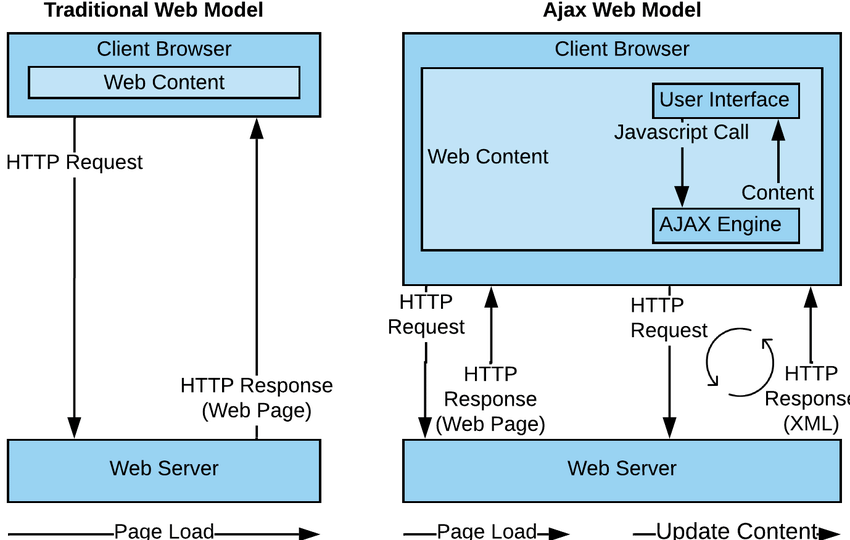

# DWEC UT04: Programación asíncrona y obtención de datos.

Un navegador, durante la carga de una página, suele realizar múltiples peticiones HTTP a un servidor para solicitar los archivos que necesita renderizar en la página. Por ejemplo, si abrimos una página, las peticiones que realizaría el navegador podrían ser las siguientes:

* El documento **.html** de la página (aquí encontraremos referencias a otros archivos)
* La hoja de estilos **.css** (probablemente existan aquí más referencias a otros archivos)
* Imágenes **.jpg**, **.png**, **.webp** u otras
* Scripts **.js** (aquí nuevamente, más referencias a otros archivos)

Por lo tanto, cuando cargamos una página (primera petición), en realidad estamos realizando múltiples peticiones posteriormente.

## Asynchronous Javascript and XML (AJAX)

AJAX es un conjunto de técnicas de desarrollo web que permiten que las aplicaciones web funcionen de forma asíncrona, procesando cualquier solicitud al servidor en segundo plano.

<p align="center"> 

</p>

Esto permite realizar peticiones basadas en peticiónes HTTP que se realizan desde Javascript, de forma **transparente** al usuario, **descargando** la información y **pudiendo tratarla** sin necesidad de mostrarla directamente en la página.

Esto produce un interesante cambio en el panorama que había hasta ahora, puesto que podemos hacer actualizaciones de contenidos de forma parcial, de modo que se actualice una página **en vivo**, sin necesidad de recargar toda la página, sino solamente actualizado una pequeña parte de ella, pudiendo utilizar Javascript para crear todo tipo de lógica de apoyo.

AJAX no es una tecnología nueva. Son realmente muchas tecnologías, cada una destacando por su propio mérito, pero que se unen con los siguientes objetivos:

* Conseguir una presentación basada en estándares, usando HTML, CSS y un uso amplio de técnicas del DOM, para poder mostrar la información de forma dinámica e interactiva.
* Intercambio y manipulación de datos, usando XML y XSLT, JSON *(mas utilizado hoy en día)*, etc.
* Recuperación de datos de forma asíncrona, usando el objeto XMLHTTPRequest.
* Uso de JavaScript, para unir todos los componentes.

<p align="center"> 

</p>

Originalmente, a este sistema de realización de peticiones HTTP se le llamó AJAX, donde la X significa XML, el formato ligero de datos que más se utilizaba en aquel entonces. Actualmente, sobre todo en el mundo Javascript, se utiliza más el formato JSON, aunque por razones fonéticas evidentes se sigue manteniendo el término **AJAX** en lugar del horrible correspondiente **AJAJ**.

## Formato de datos JSON

**JSON** son las siglas de JavaScript Object Notation, y no es más que un formato ligero de datos, con una estructura (notación) específica, que es totalmente compatible de forma nativa con Javascript. Como su propio nombre indica, JSON se basa en la sintaxis que tiene Javascript para crear objetos.

Un archivo JSON mínimo suele tener la siguiente sintaxis:

```js
{}
```

Sin embargo, su contenido puede ser simplemente un `string`, un `boolean`, un `number`, un o incluso un `null`, sin embargo, lo más habitual es que parta siendo un `array` o un `object` . Puedes comprobar en JSONLint si algo concreto es un JSON válido o no.

Este ejemplo anterior simplemente es un objeto vacío `{}`. Un archivo JSON, suele contener mucha información almacenada. Vamos a modificar ese objeto vacío para que contenga más datos para ejemplificarlo:

```js
{
    "firstName": "John",
    "lastName": "Smith",
    "address": {
        "streetAddress": "21 2nd Street",
        "city": "New York",
        "state": "NY",
        "postalCode": 10021
    },
    "phoneNumbers": ["212-732-1234","646-123-4567"]
}
```

Si comparamos un JSON con un objeto Javascript, aparecen algunas ligeras diferencias y matices:


* Las propiedades del objeto deben estar entrecomilladas con **comillas dobles**
* Los textos deben estar entrecomillados con **comillas dobles**
* Sólo se puede almacenar tipos como `string`, `number`, `boolean`, `null`, `array` o `object`.
* Tipos de datos como `function`, `date`, `regexp` u otros, no es posible almacenarlos en un JSON.
* Tampoco es posible añadir comentarios en un JSON.

Cuidado con las comillas mal cerradas o las comas sobrantes (antes de un cierre de llaves, por ejemplo). Suelen ser motivos de error de sintaxis frecuentemente. Existe una cómoda extensión para Visual Code llamada [Fix JSON](https://marketplace.visualstudio.com/items?itemName=oliversturm.fix-json) que te corrige los errores de formato de un JSON.

### Utilizando el formato JSON

Como hemos mencionado, si analizamos bien la sintaxis de un JSON, nos habremos dado cuenta que es muy similar a un objeto declarado Javascript, pero con ciertas diferencias. En Javascript tenemos una serie de métodos que nos facilitan la tarea de pasar de de Javascript a JSON y viceversa, pudiendo trabajar con contenido de tipo (que contenga un JSON) y objetos Javascript según interese.

| Método  | Descripción |
|----------|----------|
| `JSON.parse(str)` | Convierte el texto `str` (si es un JSON válido) a un `objet` y lo devuelve |
| `JSON.stringify(obj)` | Convierte un objeto `obj` a su representación JSON y la devuelve |

Veamos como podemos convertir una variable de tipo texto en un objeto para poder utilizarlo en JS:

```js
const json = `{
  "nombre": "Manolo",
  "edad": 35,
  "hobbies": ["running", "rafting", "puenting"]
}``;

const user = JSON.parse(json);

user.name;  // "Manolo"
user.edad;  // 35
uuser.hobbies[2]
```

Como se puede ver, `user` es un objeto generado a partir del JSON almacenado en la variable json y podemos consultar sus propiedades y trabajar con ellas sin problemas.

La operación inversa, convertir un objeto Javascript a JSON también se puede realizar facilmente haciendo uso del método `JSON.stringify()`. Este impronunciable método se puede utilizar para transformar un objeto de Javascript a JSON rápidamente:

```js
const student = {
    name: 'John',
    age: 30,
    isAdmin: false,
    courses: ['html', 'css', 'js'],
    spouse: null
};

let json = JSON.stringify(student);
console.log(typeof json); // convertimos el objeto a "string"
console.log(json);
```

Podemos comprobar que nos convierte las claves y valores a strings con entrecomillado doble como debe tener un objeto JSON.

JSON es una especificación de *sólo datos* independiente del lenguaje, por lo tanto algunas propiedades de objeto específicas de Javascript son omitidas por `JSON.stringify`.

* Propiedades que sean funciones (métodos).
* Propiedades simbólicas (symbol).
* Propiedades que almacenan `undefined`.

```js
let user = {
  sayHi() { // ignorado
    alert("Hello");
  },
  [Symbol("id")]: 123, // ignorado
  something: undefined // ignorado
};

console.log( JSON.stringify(user) ); // {} (objeto vacío)
```

### Exluyendo y transformado un JSON

La sintaxis completa de `JSON.stringify` es:

```js
let json = JSON.stringify(value[, replacer, space])
```


* **value** - Un valor para codificar.
* **replacer** - Array de propiedades para codificar o una función de mapeo function(propiedad, valor).
* **space** - Cantidad de espacio para usar para el formateo 

La mayor parte del tiempo, `JSON.stringify` es utilizado con el primer argumento unicamente. Pero si necesitamos ajustar el proceso de sustitución, como para filtrar las referencias circulares, podemos utilizar el segundo argumento de `JSON.stringify`.

```js
let room = {
  number: 23
};

let meetup = {
  title: "Conference",
  participants: [{name: "John"}, {name: "Alice"}],
  place: room // meetup hace referencia a room
};

room.occupiedBy = meetup; // room hace referencia a meetup

console.log( JSON.stringify(meetup, ['title', 'participants']) );
// {"title":"Conference","participants":[{},{}]}
```

Aquí probablemente seamos demasiado estrictos. La lista de propiedades se aplica a toda la estructura de objeto. Por lo tanto los objetos en participants están vacíos, porque name no está en la lista.

```js
...
console.log( JSON.stringify(meetup, ['title', 'participants', 'place', 'name', 'number']) );
/*
{
  "title":"Conference",
  "participants":[{"name":"John"},{"name":"Alice"}],
  "place":{"number":23}
}
*/
```

Anteriormente todos los objetos convertidos a `string` no tenían sangría ni espacios adicionales. Eso está bien si queremos enviar un objeto por la red. El argumento space es utilizado exclusivamente para una salida agradable.

```js
let user = {
  name: "John",
  age: 25,
  roles: {
    isAdmin: false,
    isEditor: true
  }
};

alert(JSON.stringify(user, null, 2));
/* sangría de dos espacios:
{
  "name": "John",
  "age": 25,
  "roles": {
    "isAdmin": false,
    "isEditor": true
  }
}
*/

/* para JSON.stringify(user, null, 4) el resultado sería más indentado:
{
    "name": "John",
    "age": 25,
    "roles": {
        "isAdmin": false,
        "isEditor": true
    }
}
*/
```

## Leyendo JSON externo

Ten en cuenta que los ejemplos realizados hasta ahora, estamos convirtiendo un a `string` y `object` viceversa. Normalmente los contenidos JSON suelen estar almacenados en un *archivo externo*, que habría que leer desde nuestro código Javascript.

Para ello, hoy en día se suele utilizar la función **fetch()** para hacer peticiones a sitios que devuelven contenido en formato JSON. También se podría leer ficheros locales con contenido en este mismo formato.

```js
fetch("../directorio/fichero.json")
.then(res => res.json())
.then(data => console.log(data))
```

Esto nos permitira tener separados los datos del código JS para no dificultar la manipulación de datos/código en un momento dado.

Mas adelante profundizaremos en el conepto de la API de fetch y sus metodos como el de `res.json()` que lo que hace es parsear la respuesta y convertirla a un `object` de JS.

Pero por si alguien tiene la curiosisdad de de saber la diferencia entre `.parse()` y `.json()` os dejo este [enlace](https://stackoverflow.com/questions/48295439/json-parse-vs-json) en el que hablan de las diferencias y de cuando usar uno y otro.