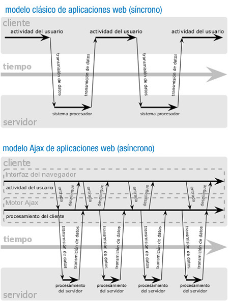
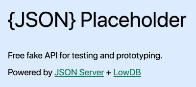
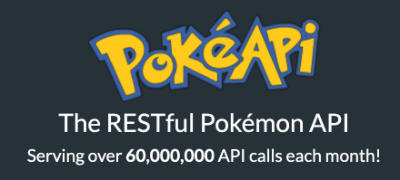
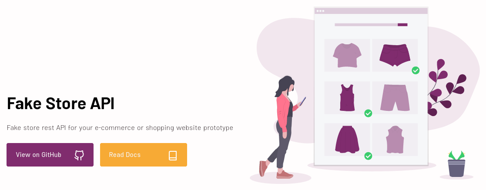
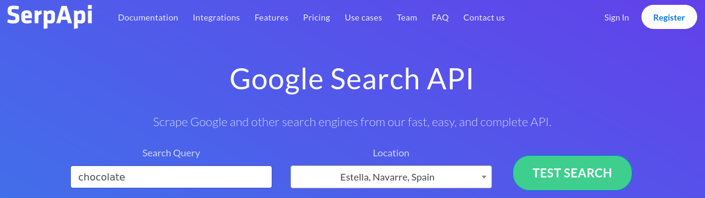

# DWEC UT04: Programación asíncrona y obtención de datos.

## Trabajando con AJAX

A la hora de trabajar con AJAX debemos tener en cuenta una serie de requisitos previos, necesarios para la programación con esta metodología.

Hasta este momento, nuestras aplicaciones de JavaScript no necesitaban de un servidor web para funcionar, salvo en el caso de querer enviar los datos de un formulario y almacenarlos en una base de datos. Es más, todas las aplicaciones de JavaScript que has realizado, las has probado directamente abriéndolas con el navegador o haciendo doble click sobre el fichero `.html` (aunque la mayoria de vosotros seguro que tenéis el plugin de liveServer para VSCode).

Este servidor lo que va a hacer es proveer de datos que no están en la misma maquina donde estamos ejecutando el navegador e interprentado la pagina web.

## Funcionamiento de AJAX

Como ya hemos comentábamos en la introducción a AJAX, la mayoría de las aplicaciones web funcionan de la siguiente forma:

1.  El usuario solicita algo al servidor.
2. El servidor ejecuta los procesos solicitados (búsqueda de información, consulta a una base de datos, lectura de fichero, cálculos numéricos, etc.).
3. Cuando el servidor termina, devuelve los resultados al cliente.

En el paso 2, mientras se ejecutan los procesos en el servidor, el cliente lo único que puede hacer es esperar, ya que el navegador está bloqueado en espera de recibir la información con los resultados del servidor.

Utilizando AJAX, cambia la metodología de funcionamiento de una aplicación web, en el sentido de que, elimina las esperas y los bloqueos que se producen en el cliente. Es decir, el usuario podrá seguir interactuando con la página web, mientras se realiza la petición al servidor. En el momento de tener una respuesta confirmada del servidor, ésta será mostrada al cliente, o bien se ejecutarán las acciones que el programador de la página web haya definido.

 

Para poder realizar las peticiones al servidor sin que el navegador se quede bloqueado, tendremos que hacer uso del motor AJAX (programado en JavaScript). Este motor se encarga de gestionar las peticiones AJAX del usuario, y de comunicarse con el servidor. Es justamente este motor, el que permite que la interacción suceda de forma asíncrona (independientemente de la comunicación con el servidor). Así, de esta forma, el usuario no tendrá que estar pendiente del icono de indicador de carga del navegador, o viendo una pantalla en blanco.

## Donde obtener información

Muchas veces necesitamos de servicios web de uso libre para el desarrollo de aplicaciones de demostración, por ejemplo para docencia cuando hacemos un curso o una presentación práctica de una herramienta.

No siempre tenemos el tiempo o los conocimientos necesarios para crear un servicio web propio, o un API REST con el que experimentar con nuestros propios datos, por lo que existen diversos servicios web públicos desde los que podemos obtener información y así realizar esas prácticas de consumo de API manera sencilla, al menos sin complicarnos con la parte de desarrollar la propia API.

Aqui vais a encontrar alernativas a APIs libres con las que puedes hacer todo tipo de pruebas y desarrollar prototipos de aplicaciones frontend, para que puedas elegir diversos servicios web que devuelven datos JSON y realizar tus prácticas de desarrollo.

A todas estas API podrás acceder mediante AJAX en aplicaciones frontend o mediante solicitudes a URLs que puedes consumir también desde el backend. Sin embargo lo más típico es que las acabes usando con algún framework Javascript y acceso AJAX.

### JSON Placeholder. [Enlace](https://jsonplaceholder.typicode.com/)

Esta es una de las APIs de uso público más conocidas y usadas. Sirve casi dos mil millones de request por mes, una barbaridad!

Este API te ofrece datos típicos de aplicaciones, como serían usuarios, tareas, fotos, posts, comentarios, albums, etc. Son diversas fuentes de datos que puedes consumir con sus endpoints al estilo de API REST perfectamente estándar.

Incluso los datos que se ofrecen están relacionados por ejemplo los comentarios pertenecen a los posts o los albums tienen fotos.

Podemos usar este API REST sin ningún tipo de registro.

 

### Marvel API. [Enlace](https://developer.marvel.com/)

Ese API ofrece información de los comics de Marvel, como los personajes superhéroes y supervillanos. Puedes usar el API de manera libre para realizar cualquier tipo de desarrollo que quieras imaginar con estos datos.

Para usarla requiere registrarse en el sitio de Marvel Developers y obtener un API Key. Tiene límites de uso, que generalmente no gastarás si estás haciendo prototipos, pero quizás si haces algo grande con este API requiera desbloquear esos límites.

 

### RESTful Pokémon API. [Enlace](https://pokeapi.co/)

Este API ofrece información del mundo de Pokemon en formato API RESTful y ahora también para el acceso mediante GraphQL.

Tienes información de toda la serie de juegos de Pokemon, incluso con fotos de los personajes. El acceso es publico y no requiere ningún proceso de registro para usar los datos.

 

### Random User Generator. [Enlace](https://randomuser.me/)

Este API está genial si necesitas listas de usuarios con datos personales típicos, nombres, direcciones, emails, fechas de nacimiento, teléfono, etc. Hasta contienen fotos de los avatares de los usuarios.

Para usarla no necesitas registrarte ni autenticar usuarios.

 

### The Rick and Morty API. [Enlace](https://rickandmortyapi.com/)

API para obtener datos de la serie de dibujos animados Rick & Morty. No es necesario registrarse para obtener información.

 

### Fake Store API. [Enlace](https://fakestoreapi.com/)

API para obtener datos de la serie de dibujos animados Rick & Morty. No es necesario registrarse para obtener información.

 

### SerpApi. [Enlace](https://serpapi.com/)

API para obtener datos de la serie de dibujos animados Rick & Morty. No es necesario registrarse para obtener información.

 

## Diferentes manera de obtener datos

Existen varias formas de realizar peticiones HTTP mediante AJAX, pero las principales suelen ser `XMLHttpRequest` y `fetch` (nativas, incluidas en el navegador por defecto), además de liberías externas como por ejemplo `axios` o `jQuery`:

| Método  | Descripción |
|----------|----------|
| `XMLHttpRequest` | Abreviado como XHR. El más antiguo, y también más verbose. Nativo. |
| `fetch` | Nuevo sistema nativo de peticiones basado en promesas. Nativo. |
| `jQuery` | Libreria cross-browser que permiter hacer consultas de datos simples  |

Iremos viendo cada uno por separado y analizaremos su funcionamiento y diferencias que existen entre ellos.