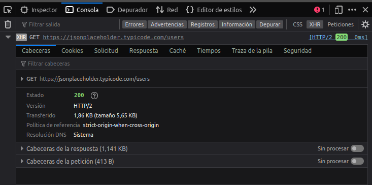
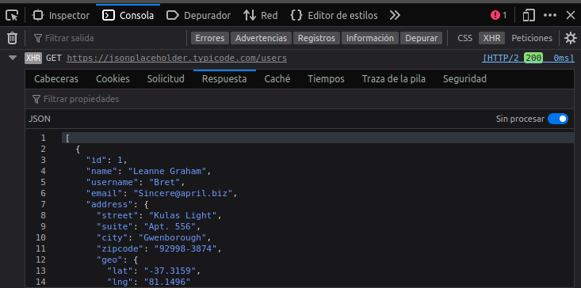
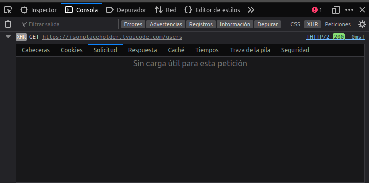
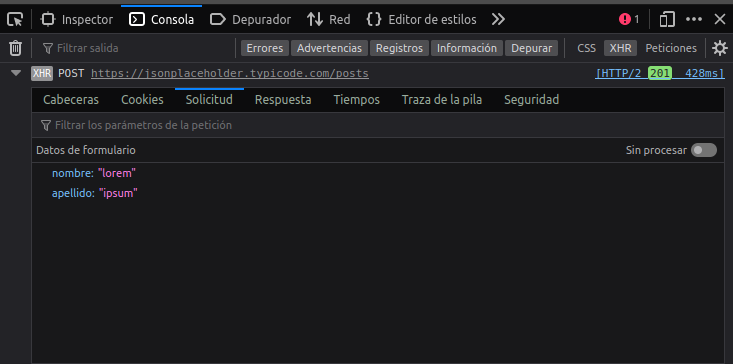
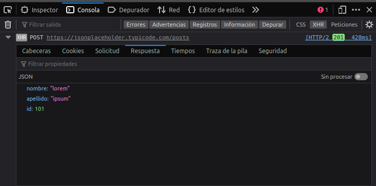

# DWEC UT04: Programación asíncrona y obtención de datos.

## La interfaz XMLHttpRequest (XHR)

**XMLHttpRequest** (**XHR**), también referida como XMLHTTP (Extensible Markup Language/Hypertext Transfer Protocol), es una interfaz empleada para realizar peticiones HTTP y HTTPS a servidores Web. Para los datos transferidos se usa cualquier codificación basada en texto, incluyendo: texto plano, *XML*, *JSON*, *HTML* y codificaciones particulares específicas. La interfaz se implementa como una clase de la que una aplicación cliente puede generar tantas instancias como necesite para manejar el diálogo con el servidor.

El uso más popular, si bien no el único, de esta interfaz es proporcionar contenido dinámico y actualizaciones asíncronas en páginas web mediante tecnologías construidas sobre ella como por ejemplo *AJAX*. Los datos recibidos, podrán ser utilizados para modificar el DOM del documento actual, sin tener que recargar la página, o también podrán ser evaluados con JavaScript, si son recibidos en formato JSON.

## Creando un objeto XHR

XMLHttpRequest (XHR) es un objeto especial de Javascript que permite realizar peticiones HTTP asíncronas de forma nativa desde Javascript. Se trata de la primera implementación que existió, disponible en ^ antes de que surgiera `fetch`, el estándar recomendado actual.

> Actualmente es más frecuente utilizar `fetch`, puesto que es una API más actual y moderna que utiliza **promesas** y nos permite hacer lo mismo (o más) escribiendo menos código.

El objeto XHR se creó originalmente para realizar peticiones HTTP a ficheros `.xml` externos desde Javascript. Actualmente, se realizan las mismas operaciones pero con ficheros `JSON`, ya que son mucho más habituales en el ecosistema Javascript como almacenamiento ligero de datos.

Para crear un objeto de este tipo lo que necesitamos hacer es crearlo a mano (el constructor no tiene argumentos).

```js
let xhr = new XMLHttpRequest();
```
Despues tenemos que "iniciarlo" (configurarlo) con el metodo `open()`.

```js
xhr.open(method, URL, [async, user, password])
```

Este método especifica los parámetros principales para la petición:

* **method** – método HTTP. Usualmente `GET` o `POST`.
* **URL** – la URL a solicitar, una cadena, puede ser un objeto URL.
* **async** – si se asigna explícitamente a `false`, entonces la petición será síncrona. 
* **user**, **password** – usuario y contraseña para autenticación HTTP básica (si se requiere).

Por favor, toma en cuenta que la llamada a `open`, contrario a su nombre, no abre la conexión. Solo configura la solicitud, pero la actividad de red solo empieza con la llamada del método `send`.

Cuando este configurado, solo quedaria enviar la petición con el medoto `send()`.

```js 
xhr.send([body])
```

Este método abre la conexión y envía la solicitud al servidor. El parámetro adicional `body` contiene el cuerpo de la solicitud. Algunos métodos como `GET` no tienen un cuerpo. Y otros como `POST` usan el parámetro `body` para enviar datos al servidor.

Una vez enviada la solicitud, nos quedaria estar a la escucha de los eventos que se vayan produciendo en relación a nuestra petición. Estos son los tres eventos más comúnmente utilizados:

* **load** – cuando la solicitud está; completa (incluso si el estado HTTP es 400 o 500), y la respuesta se descargó por completo.
* **error** – cuando la solicitud no pudo ser realizada satisfactoriamente, ej. red caída o una URL inválida.
* **progress** – se dispara periódicamente mientras la respuesta está siendo descargada, reporta cuánto se ha descargado.

```js
// 1. Crea un nuevo objeto XMLHttpRequest
let xhr = new XMLHttpRequest();
// 2. Configuración: solicitud GET para la URL /article/.../load
xhr.open('GET', '/robots.txt');
// 3. Envía la solicitud a la red
xhr.send();
// 4. Esto se llamará después de que la respuesta se reciba
xhr.onload = function() {
  if (xhr.status != 200) { // analiza el estado HTTP de la respuesta
    alert(`Error ${xhr.status}: ${xhr.statusText}`); // ej. 404: No encontrado
  } else { // muestra el resultado
    alert(`Hecho, obtenidos ${xhr.response.length} bytes`); // Respuesta del servidor
  }
};
xhr.onprogress = function(event) {
  if (event.lengthComputable) {
    alert(`Recibidos ${event.loaded} de ${event.total} bytes`);
  } else {
    alert(`Recibidos ${event.loaded} bytes`); // sin Content-Length
  }
};
xhr.onerror = function() {
  alert("Solicitud fallida");
};
```
En este ejemplo estoy utilizando un fichero `robots.txt` que esta ubicado en la misma carpeta que mi documento HTML y utilizando el plugin de **LiveServer** de VSCode.

> ¿Que es el fichero robots.txt? [Enlace](https://www.cloudflare.com/es-es/learning/bots/what-is-robots-txt/)

### Propiedades del objeto XHR

Al crear un objeto `XMLHttpRequest` tenemos acceso a una serie de propiedades que forman parte de nuestra instancia.

| Propiedad | Tipo | Descripción |
|----------|----------|----------|
| `.responseType` | `string` | Define el tipo de respuesta de `.response`: json, Blob, etc. Por defecto, text. |
| `.response` | `object` | Contenido parseado automáticamente basado en `.responseType`. |
| `.responseText` | `string` | Respuesta de la petición como texto plano, o si no se ha recibido. |
| `.responseURL` | `string` | URL de la petición HTTP a realizar. |
| `.readyState` | `number` | Número que indica en que estado se encuentra la petición (ver más adelante). |
| `.timeout` | `number` | Milisegundos permitidos para realizar la petición HTTP. Por defecto, 0 (sin límite). |
| `.status` | `number` | Código de respuesta HTTP de la petición. |
| `.statusText` | `string` | Texto con el código de respuesta, legible para humanos. |
| `.withCredentials`| `boolean` | Indica si la petición HTTP se está realizando con credenciales. |

En primer lugar, las propiedades `.responseType` y `.response` se usan conjuntamente, debido a que si establecemos un valor en `.responseType` antes de hacer la petición, se procesará automáticamente la respuesta en `.response`. Por ejemplo, si establecemos el valor "json" en la propiedad `.responseType`, en `.response` obtendremos el objeto JSON parseado.

Por otro lado, en la propiedad `.responseText` siempre obtendremos el valor de texto puro, por si ese proceso de parseo queremos hacerlo manualmente. En la propiedad `.responseURL` tendremos la ruta completa de la petición HTTP.

```js
let xhr = new XMLHttpRequest();
xhr.open('GET', 'https://jsonplaceholder.typicode.com/users');
xhr.responseType = "json"
xhr.send()
xhr.onload = function () {
    console.log(xhr.response)           //directamente convierte la respuesta en JSON
    console.log(xhr.responseText)       //nos da error por que la respuesta se la hemos pedido en formato JSON
};
```

La propiedad `.readyState` de nuestra instancia client es un valor numérico (representado por una constante) que indica en el punto de progreso en que se encuentra la petición HTTP.

| Valor | Constante | Descripción |
|----------|----------|----------|
| 0 | `XMLHttpRequest.UNSENT` | Estado inicial. No se ha ejecutado aún `.open()`. |
| 1 | `XMLHttpRequest.OPENED` | Se ha ejecutado `open()`, pero no se ha ejecutado aún `.send()`. |
| 2 | `XMLHttpRequest.HEADERS_RECEIVED` | Se ha ejecutado `send()`. Cabeceras recibidas. |
| 3 | `XMLHttpRequest.LOADING` | Descarga de información en proceso. |
| 4 | `XMLHttpRequest.DONE ` | Descarga finalizada. |

Para verlo más claramente, podemos observar el siguiente código, donde a través de la escucha del evento readystatechange de la instancia en cuestión, podemos estar pendientes de cuando obtenemos la información (`readyState` igual a 4 y `status` 200 OK)

```js
const xhr = new XMLHttpRequest();
xhr.addEventListener("readystatechange", () => {
  const isDone = xhr.readyState === 4;
  const isOk = xhr.status === 200;
  if (isDone && isOk) {
    console.log(xhr.responseText);
  }
});
xhr.open("GET", "/robots.txt");
xhr.send();
```

Las propiedades `.status` y `.statusText` nos muestran el código de error HTTP devuelto por la petición. La propiedad `.status` de vuelve el número en cuestión (200 = OK, 404 = Not Found, etc...) y la propiedad `.statusText` nos devuelve un texto un poco más legible donde nos da algo más de información.

> Los posibles códigos de estado de las respuestas HTTP las puedes consultar en el siguiente [enlace](https://developer.mozilla.org/es/docs/Web/HTTP/Status).

### Eventos de XHR

Durante el manejo de objetos `XMLHttpRequest` pueden suceder determinados eventos que podemos controlar desde nuestro código. Dichos eventos son los siguientes.

| Evento | Descripción |
|----------|----------|
| `abort` | Se dispara cuando una petición es cancelada. |
| `load` | Se dispara cuando una petición se ha completado correctamente. |
| `loadstart` | Se dispara cuando una petición comienza a cargar datos. |
| `loadend` | Se dispara cuando una petición termina (con error o sin ellos). |
| `error` | Se dispara cuando una petición sufre un error. |
| `timeout` | Se dispara cuando una petición agota el tiempo máximo. |
| `progress` | Se dispara (varias veces) cuando una petición recibe datos. |
| `readystatechange` | Se dispara cuando el valor `.readyState` cambia. |

Ya hemos visto algunos de estos eventos en acción en los ejemplos anteriores. De hecho, se puede conseguir el mismo efecto utilizando los diferentes valores de la propiedad `readyState` y los eventos, es cuestión de gustos (y a veces necesidades) el utilizar una manera u otra.

Tipicamente, un ejemplo que podreis enconctrar a menudo (y uno de los mas simples y utilizados) es algo parecido a esto.

```js
const xhr = new XMLHttpRequest();
xhr.addEventListener('readystatechange', function(){
if(xhr.readyState === 4) {
    if(xhr.status === 200) {
          console.log(xhr.responseText);
    } else {
          console.log('Error Code: ' +  xhr.status);
          console.log('Error Message: ' + xhr.statusText);
    }
  }
})

xhr.open('GET', 'request_ajax_data.php');
xhr.send();
```

Este ejemplo es muy parecido al que hemos utilizado en el primer ejemplo cuando hemos hecho uso de `.onload()`, `.onprogress()` y `.onerror()`

> Podeis encontrar mas información sobre los eventos de XHR en el siguiente [enlace](https://developer.mozilla.org/en-US/docs/Web/API/XMLHttpRequest#events).

### Enviando con GET

Como podemos leer en la documentación de MDN acerca de peticiones `GET`:

> The HTTP GET method requests a representation of the specified resource. Requests using GET should only be used to request data (they shouldn't include data).

Es decir que la petición que hagamos no debera llevar datos en el cuerpo. Pero si que podremos mandar infromación en la URL de la petición que hagamos.

```js
xhr.open("GET", "/test/demo_form.php?name1=value1&name2=value2")
```

Teniendo en cuenta esto, no deberemos utilizar el metodo `GET` cuando estemos tratando con información sensible (como ususarios y contraseñas) ya que estos datos serán visibles en la URL.

Veamos un ejemplo y analicemoslo con las herramientas de depuración.

```js
  let xhr = new XMLHttpRequest();
  xhr.open('GET', 'https://jsonplaceholder.typicode.com/users');
  xhr.send()
  xhr.onload = function () {
    console.log(xhr.responseText)
  };
```

En la parte superior derecha podeis fijaros como activando la visualización de `XHR` podemos ver las peticiones que se han realizado. En las diferentes pestañas vereis por ejemplo la respuesta obtenida de esa petición.

<p align="center"> 

</p>

<p align="center"> 

</p>

Podeis observar que en la pestaña de solicitud no hay nada, ya que no se ha enviado dato alguno en el cuerpo de la petición.

<p align="center"> 

</p>

Probar este ejemplo y mirar cual es el resultado.

```js
  let xhr = new XMLHttpRequest();
  xhr.open('GET', 'https://jsonplaceholder.typicode.com/users?id=2');
  xhr.send()
  xhr.onload = function () {
    console.log(xhr.responseText)
  };
```
### Enviando con POST

Como podemos leer en la documentación de MDN acerca de peticiones `POST`:

> The HTTP POST method sends data to the server. The type of the body of the request is indicated by the `Content-Type` header.

Habitualmente las peticiones `POST` se suelen realizar cuando enviamos un formulario (el valor de sus campos `input`) y esta información si que se añade en el cuerpo de la petición.

```js
let xhr = new XMLHttpRequest();
xhr.open('POST', 'https://jsonplaceholder.typicode.com/posts');
xhr.setRequestHeader("Content-Type", "application/x-www-form-urlencoded")
xhr.send("nombre=lorem&apellido=ipsum")
xhr.onload = function () {
    console.log(xhr.responseText)       
};
```

Analizando esta petición con las herramientas del navegador podemos ver lo siguiente en la petición no hay valores directamente en la URL. Estos datos enviados van en el cuerpo y por lo tanto aparecen en la pestaña de solicitud.

<p align="center"> 

</p>

<p align="center"> 

</p>

Y si nos fijamos en la respuesta (en este caso concreto), se nos devuelve los valores que hemos enviado y un campo `id` con el valor `101` que seria el que tendría si nos dejara insertar definitivamente los valores en el servidor.

<p align="center"> 

</p>

> #### *Tener en cuenta que ...*
> Al estar realizando una petición `POST` estamos intentando modificar/añadir/actualizar algun valor en el lado del servidor. Pero en los ejemplo de arriba estamos utilizando una API que no nos pertenece, por lo que no sabemos como se estan procesando los datos en el lado del servidor.
>
> Si quereis tener control de lo que se esta haciendo en la parte del servidor podeis montaros un servidor web con XAMPP (ya que incluye PHP y comprobar el comportamiento manipulando los datos que se devuelven).
> Despues de instalar XAMP, crear un fichero index.php y añadir el siguiente código:
> ```php
> <?php
>	// Imprimimos un mensaje con los textos recibidos
>	if (isset($_GET['nombre']))
>		echo "<p>Saludos desde el servidor: hola {$_GET['nombre']} {$_GET['apellidos']}.</p>";
>	else if (isset($_POST['nombre']))
>		echo "<p>Saludos desde el servidor: hola {$_POST['nombre']} {$_POST['apellidos']}. </p>";		
>	// Mostramos la fecha y hora del servidor web.
>	echo "<p>La fecha y hora del Servidor Web: ";
>	echo date("j/n/Y G:i:s"); 
>	echo "</p>";
>?>
> ```
>
> Este fichero debereis ubicarlo en la carpeta `htdocs` de XAMP y despues ya estareis en condiciones de hacer una petición a vuestro servidor web. Recordad que XAMP seguramente este escuchando en el puerto 80 y vuestro LiveServer de VSCode en algun otro puerto (5501 o parecido). Tendreis que añadir toda la URL correctamente.
> ```js
> let xhr = new XMLHttpRequest();
> xhr.open('POST', 'https://localhost/index.php');
> xhr.setRequestHeader("Content-Type", "application/x-www-form-urlencoded")
> xhr.send("nombre=lorem&apellido=ipsum")
> xhr.onload = function () {
>    console.log(xhr.responseText)       
> };
> ```

### Cabeceras de un XHR

Las cabeceras (en inglés headers) HTTP permiten al cliente y al servidor enviar información adicional junto a una petición o respuesta. Una cabecera de petición esta compuesta por su nombre (no sensible a las mayusculas) seguido de dos puntos `:`, y a continuación su valor (sin saltos de línea). 

| Método | Descripción |
|----------|----------|
| `.setRequestHeader(name, value)` | Permite añadir la cabecera `name` con el valor `value` a la petición HTTP. |
| `.getAllResponseHeaders()` | Obtiene todas las cabeceras HTTP de la respuesta de la petición. |
| `.getResponseHeader(name)` | Obtiene una cabecera HTTP concreta de la respuesta de la petición. |

Ya hemos visto como podemos utilizar estos metodos para añadir información a nuestras peticiones cuando hemos modificado `Content-Type` para indicarle que el tipo de datos que estamos enviando/solicitando era en formato `JSON`  o cuando le hemos indicado que los datos a enviar estaban códificados en formato de formulario.

```js
xhr.setRequestHeader("Content-Type", "application/x-www-form-urlencoded")

xhr.setRequestHeader("Content-Type", "application/json")
```

> Podeis encontrar información mas detallada acerca de cabeceras HTTP en el siguiente [enlace](https://code.tutsplus.com/es/http-headers-for-dummies--net-8039t)

### Enviando datos de un formulario

Cuando estamos utilizando un formulario para obtener información del usuario y queremos enviar estos datos a través de una petición XHR, podemos utilizar el objeto `FormData` para convertir y añadir directamente los datos al cuerpo de la petición.

```js
let formData = new FormData([form]); // creamos el objteo con los datos (tambien se puede crear vacio e ir añadiendo datos y valores)
formData.append(name, value); // añadimos un dato nuevo
```

Veamos como funcionaria con un ejemplo.

```html
<form name="formulario">
  <input name="name" value="John">
  <input name="surname" value="Smith">
</form>
<script>
  // rellenamos el objeto con los datos del formulario
  let formData = new FormData(document.forms.formulario);
  // añadimos un campo mas
  formData.append("middle", "Lee");
  // lo enviamos
  let xhr = new XMLHttpRequest();
  xhr.open("POST", "/process_user_data.php");
  xhr.send(formData);

  xhr.onload = () => console.log(xhr.response);
</script>
```

En este caso los datos son enviados con codificación `multipart/form-data`. 

Si queremos enviar los datos en otro formato, digamos `JSON`, tendremos que convertir nuestros datos (que pueden obtenerse de algún objeto) y despues enviarlos. En este caso tendremos que modificar el `Content-Type` para que el servidor lo procese adecuadamente.

```js
let xhr = new XMLHttpRequest();
let json = JSON.stringify({
  name: "John",
  surname: "Smith"
});

xhr.open("POST", '/procesar-datos.php')
xhr.setRequestHeader('Content-type', 'application/json; charset=utf-8');
xhr.send(json);
```

> Aqui podeis consultar un pequeño acticulo donde comenta las diferentes formas de envio de información y los tipos de datos que son soportados para cada `Content-Type`. [Enalce](https://medium.com/@codingscenes/application-x-www-form-urlencoded-and-multipart-form-data-are-two-different-formats-for-3678a10073e9)