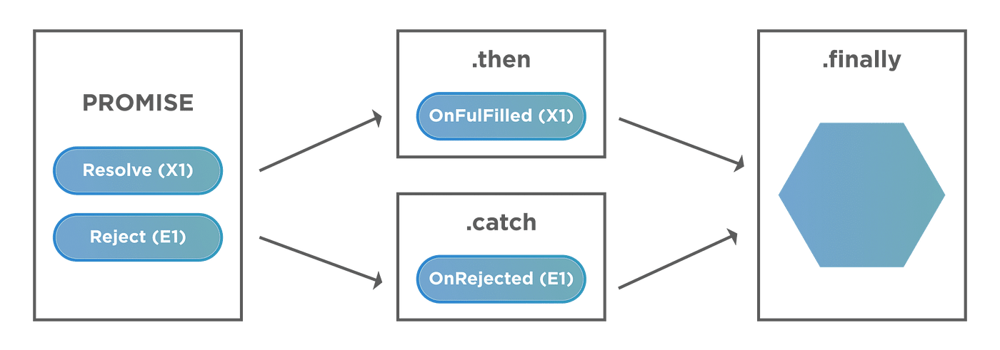

# DWEC UT04: Programación asíncrona y obtención de datos.

## Promesas

Las **promesas** son un concepto para resolver el problema de asincronía de una forma mucho más elegante y práctica que, por ejemplo, utilizando funciones callbacks directamente.

Como su propio nombre indica, una **promesa** es algo que, en principio pensamos que se cumplirá, pero en el futuro pueden ocurrir varias cosas:

<p align="center"> 

</p>

* La promesa se cumple (promesa resuelta)
* La promesa no se cumple (promesa rechazada)
* La promesa se queda en un estado incierto indefinidamente (promesa pendiente)

Con estas sencillas bases, podemos entender el funcionamiento de una promesa en Javascript. Antes de empezar, también debemos tener claro que existen dos partes importantes de las promesas: como **consumirlas** (utilizar promesas) y como **crearlas** (preparar una función para que use promesas y se puedan consumir).

## Utilizando promesas

Las promesas en Javascript se representan a través de un `object`, y cada promesa estará en un estado concreto: **pendiente**, **aceptada** o **rechazada**. Además, cada promesa tiene los siguientes métodos:

| Método | Descripción |
|----------|----------|
| `.then(function resolve)` | Ejecuta la función callback `resolve` cuando la promesa se cumple. |
| `.catch(function reject)` | Ejecuta la función callback `reject` cuando la promesa se rechaza. |
| `.then(function resolve,function reject)` | Método equivalente a las dos anteriores en el mismo `.then()`. |
| `.finally(function end)` | Ejecuta la función callback `end` tanto si se cumple como si se rechaza. |

Más adelante veremos, que a diferencia del apartado anterior donde se utilizaban solamente funciones callback, en este enfoque se tiende a **no anidar promesas**, evitando así el famoso Callback Hell, y haciendo el código mucho más legible.

## Consumir promesas

La forma general de consumir una promesa es utilizando el .then() con un sólo parámetro, puesto que muchas veces lo único que nos interesa es realizar una acción cuando la promesa se cumpla:

```js
fetch("/robots.txt").then(function(response) {
  /* Código a realizar cuando se cumpla la promesa */
});
```

Lo que vemos en el ejemplo anterior es el uso de la función `fetch()`, la cuál devuelve una promesa que se cumple cuando obtiene respuesta de la petición realizada. De esta forma, estaríamos preparando (de una forma legible) la forma de actuar de nuestro código a la respuesta de la petición realizada, todo ello de forma asíncrona.

Recuerda que podemos hacer uso del método `.catch()` para actuar cuando se rechaza una promesa. Observa como hemos indentado los métodos `.then()` y `.catch()`, ya que se suele hacer así para que sea mucho más legible. Además, se pueden encadenar varios `.then()` si se siguen generando promesas y se devuelven con un return:

```js
fetch("/robots.txt")
  .then(response => {
    return response.text(); // Devuelve una promesa
  })
  .then(data => {
    console.log(data);
  })
  .catch(error => { 
    /* Código a realizar cuando se rechaza la promesa */ 
  });
```

> #### *Tener en cuenta que ...*
> No olvides indicar el return para poder encadenar las siguientes promesas con `.then()`. Tras un `.catch()` también es posible encadenar `.then()` para continuar procesando promesas.

De hecho, usando **arrow functions** se puede mejorar aún más la legibilidad de este código, recordando que cuando sólo tenemos una sentencia en el cuerpo de la arrow function hay un `return` implícito:

```js
fetch("/robots.txt")
  .then(response => response.text())
  .then(data => console.log(data))
  .finally(() => console.log("Terminado."))
  .catch(error => console.error(data));
```

### Codigo no bloqueante

Algo muy importante, pero que quizás hemos pasado por alto es que el código que ejecutamos en el interior de un `.then()` es código asíncrono no bloqueante:

* Asíncrono: Porque probablemente no se ejecutará de inmediato, sino que tardará en ejecutarse.
* No bloqueante: Porque mientras espera ser ejecutado, no bloquea el resto del programa.

¿Qué significa esto? Significa que cuando llegamos a un `.then()`, el sistema no se bloquea, sino que deja la función «pendiente» hasta que se cumpla la promesa, pero mientras, continua procesando el resto del programa. Observa el siguiente ejemplo:

```js
fetch("/robots.txt")
  .then(response => response.text())
  .then(data => {
    console.log("Código asíncrono");
  });

console.log("Código síncrono")
```

Aunque el `console.log("Código asíncrono")` figure unas líneas antes del `console.log("Código síncrono")`, se mostrará más tarde. Esto ocurre porque el `console.log()` del interior del `.then()` no ocurre inmediatamente, y al no ser bloqueante, se continua con el resto del programa hasta que se ejecute, que lo retomará.

> Más adelante veremos que manejar promesas con `async/await` si que es **bloqueante** y funciona de forma diferente al `.then()`, que es **no bloqueante**.

## Crear promesas

En los apartados anteriores hemos aprendido que son las promesas y hemos visto como consumirlas utilizando `.then()`. Ahora nos queda la cuestión opuesta, aprender a **crear** o **implementar** funciones que devuelvan promesas que puedan consumirse posteriormente.

Volvamos al ejemplo del dado pero en este caso utilizando promesas. Observa que creamos un nuevo objeto `promise` que «envuelve» toda la función `doTask()`.

Al `new Promise()` se le pasa por parámetro una función con dos **callbacks**:

* El primer callback, `resolve`, lo utilizaremos cuando se cumpla la promesa.
* El segundo callback, `reject`, lo utilizaremos cuando se rechace la promesa.

```js
const doTask = (iterations) => {
  return new Promise( (resolve, reject) => {
    const numbers = [];

    for (let i = 0; i < iterations; i++) {
      const number = 1 + Math.floor(Math.random() * 6);
      numbers.push(number);
      if (number === 6) {
        reject({
          error: true,
          message: "Se ha sacado un 6"
        });
      }
    }

    resolve({
      error: false,
      value: numbers
    });
  })
};
```

Como ves, se trata de una implementación muy similar a los callbacks que vimos en el apartado anterior, pero observa que se devuelve una **promesa** que envuelve toda la función, permitiendo así consumirla cómodamente más tarde:

```js
doTask(10)
  .then(result => console.log("Tiradas correctas: ", result.value))
  .catch(err => console.error("Ha ocurrido algo: ", err.message));
```