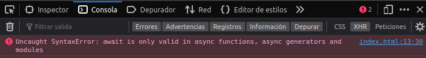

# DWEC UT04: Programación asíncrona y obtención de datos.

## Async/await

En se introducen las palabras clave `async/await`, que no son más que una forma de **sugar sintax** para gestionar las **promesas** de una forma más similar a lo que solemos estar acostumbrados. Recordemos un fragmento de código donde manejamos promesas mediante `.then()`:

```js
fetch("/robots.txt")
  .then(response => response.text())
  .then(data => console.log(data));

console.log("Código síncrono.");
```

Con `async/await` seguimos manejando promesas, sin embargo, hay ciertos cambios importantes:

* No encadenamos mediante `.then()`, sino que usamos un sistema más tradicional.
* Abandonamos el modelo **no bloqueante** y pasamos a uno **bloqueante**.

Vamos a modificar el fragmento de código anterior, para manejar la que devuelve el `fetch()`, pero en lugar de gestionarla con `.then()`, lo haremos con `await`. Simplemente, cualquier que tengamos, le añadimos la palabra clave await antes.

```js
const response = await fetch("/robots.txt");
const data = await response.text();
console.log(data);

console.log("Código síncrono.");
```

La palabra clave `await` recibe una Promesa y la convierte en un valor de retorno (o genera una excepción en caso de error). Cuando usamos `await`, JavaScript **esperará hasta que finalice** la Promesa. Si se completa con éxito (el término utilizado es fulfilled), el valor obtenido es retornado. Si la Promesa es rechazada (el término utilizado es rejected), se retorna el error arrojado por la excepción.

Ahora, vamos a introducir este fragmento de código dentro de una función llamada request(). 

```js
function request() {
  const response = await fetch("/robots.txt");
  const data = await response.text();
  return data;
}

request();
```

Sin embargo, aquí tenemos un problema. Estamos utilizando `await` (**asíncrono**) dentro de `request()` (**síncrono**), por lo que antes de ejecutarla, al intentarla definir, nos aparecerá el siguiente error:

<p align="center"> 

</p>

Para resolver el problema anterior y poder utilizar el `await` dentro de nuestra función, sólo tenemos que definir nuestra función como función **asíncrona** y al llamarla utilizar nuevamente el `await`:

```js
async function request() {
  const response = await fetch("/robots.txt");
  const data = await response.text();
  return data;
}

await request();
```

Sin embargo, vamos a pararnos un poco a pensar esto desde las bases. Definamos dos funciones básicas exactamente iguales, ambas devuelven lo mismo, pero una es **síncrona** y otra **asíncrona**:

```js
function sincrona() { return 42; }
async function asincrona() { return 42; }

sincrona();   // 42
asincrona();  // Promise <fulfilled>: 42
```

En principio, el comportamiento de `await` solo permite que se utilice en el interior de funciones declaradas como `async`. Por lo que, si el ejemplo anterior lo ejecutamos en una **consola de Javascript**, funcionará correctamente (estamos escribiendo comandos de forma asíncrona), pero si lo escribimos en un **fichero**, probablemente nos aparecerá un error.

Esto ocurre porque estamos ejecutando `await` en el contexto global de la aplicación, y debemos ejecutarlo en un contexto de función **asíncrona**. Muchas veces, para solucionar esto, lo que se suele hacer es lo siguiente:

```js 
function request() {
    return (async () => await fetch("/robots.txt"))();
}
```

## Ejemplo del dado

Volvamos al ejemplo que hemos visto antes. Recordemos que la función `doTask()` realiza 10 lanzamientos de un dado y nos devuelve los resultados obtenidos o detiene la tarea si se obtiene un 6. La implementación de la función sufre algunos cambios, simplificándose considerablemente.

* En primer lugar, añadimos la palabra clave **async** antes de los parámetros de la arrow function.
* En segundo lugar, desaparece cualquier mención a promesas, se devuelven directamente los objetos, ya que al ser una función **async** se devolverá todo envuelto en una `promise`:

```js
const doTask = async (iterations) => {
    const numbers = [];

    for (let i = 0; i < iterations; i++) {
        const number = 1 + Math.floor(Math.random() * 6);
        numbers.push(number);
        if (number === 6) {
            throw {
                error: true,
                message: "Se ha sacado un 6"
            };
        }
    }

    return {
        error: false,
        value: numbers
    };
};
```

Pero donde se introducen cambios considerables es a la hora de **consumir** las promesas con `async/await`. No tendríamos que utilizar `.then()`, sino que podemos simplemente utilizar `await` para esperar la resolución de la **promesa**, obteniendo el valor directamente:

```js
const executeTask = async () => {
    try {
        const result = await doTask(10);
        console.log("Tiradas correctas: ", result.value);
    } catch (err) {
        console.error("Ha ocurrido algo: ", err.message);
    }
};

executeTask();
```