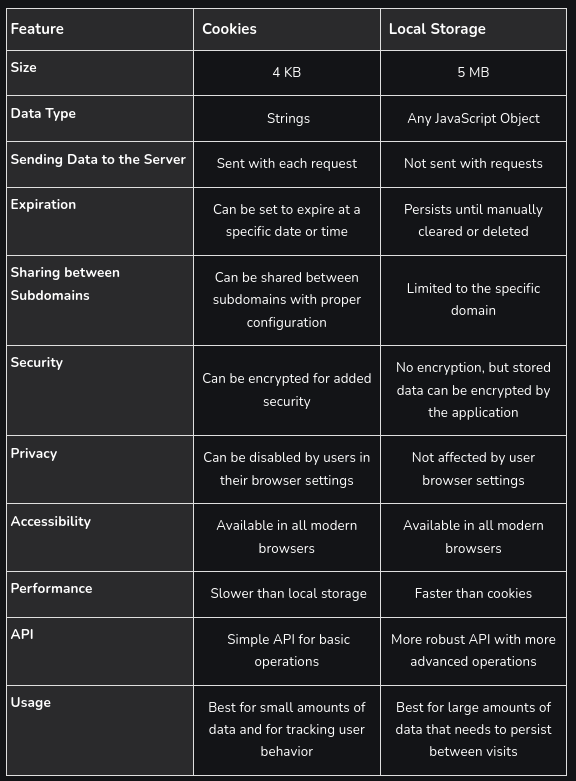

# DWEC UT04: Programación asíncrona y obtención de datos.

## Almacenamiento en el navegador

Los navegadores pueden almacenar cierta cantidad de información y de manera temporal o permanente. Vamos a ver la diferencia que existen entre las conocidisimas `coockies`, y los `localStorage` y `sessionStorage`.

## Las coockies

Las cookies son pequeñas cadenas de datos que se almacenan directamente en el navegador. Son parte del protocolo HTTP, definido por la especificación RFC 6265. Las cookies son usualmente establecidos por un servidor web utilizando la cabecera de respuesta HTTP `Set-Cookie`. Entonces, el navegador los agrega automáticamente a (casi) toda solicitud del mismo dominio usando la cabecera HTTP `Cookie`.

Uno de los casos de uso más difundidos es la **autenticación**:

* Al iniciar sesión, el servidor usa la cabecera HTTP `Set-Cookie` en respuesta para establecer una cookie con un “*identificador de sesión*” único.
* Al enviar la siguiente solicitud al mismo dominio, el navegador envía la cookie usando la cabecera HTTP Cookie.
* Así el servidor sabe quién hizo la solicitud.

También podemos acceder a las cookies desde el navegador usando la propiedad `document.cookie`.

### Leyendo coockies

El valor de `document.cookie` consiste de pares `name=value` delimitados por ";". Cada uno es una cookie separada. Para encontrar una cookie particular, podemos separar (split) `document.cookie` por ";" y encontrar el nombre correcto. Podemos usar tanto una expresión regular como funciones de array para ello.

```js
// En la mayoria de paginas se utlizan cookies, podeis probar con las herramientas de depuración en cualquier web y ver lo que devuelve
console.log( document.cookie ); // cookie1=value1; cookie2=value2;...
```

### Escribiendo coockies

Podemos escribir en `document.cookie` pero no es una propiedad de *datos*, es un accessor (getter/setter). Una asignación a él se trata especialmente. Una operación de escritura a `document.cookie` actualiza solo las cookies mencionadas en ella, y no toca las demás.

```js 
document.cookie = "user=John"; // modifica solo la cookie llamada 'user'
console.log(document.cookie); // muestra todas las cookies


// los caracteres especiales (espacios), necesitan codificarse
let name = "my name";
let value = "John Smith"
// codifica la cookie como my%20name=John%20Smith
document.cookie = encodeURIComponent(name) + '=' + encodeURIComponent(value);
console.log(document.cookie); // ...; my%20name=John%20Smith
```

> #### *Tener en cuenta que ...*
> * El par `name=value`, después de *encodeURIComponent*, no debe exceder 4KB.
> * La cantidad total de cookies por dominio está limitada a alrededor de 20, el límite exacto **depende del navegador**.

### Opciones de coockies

Entre algunas opciones mas utilizadas con las coockies podemos destacar:

* **path**: La ruta del prefijo `path` debe ser absoluto. Esto hace la cookie accesible a las páginas bajo esa ruta. Si una cookie es establecida con `path=/admin`, será visible en las páginas `/admin` y /`admin/something`, pero no en `/home` o `/adminpage`. Usualmente, debemos configurarlo en la raíz: `path=/` para hacer la cookie accesible a todas las páginas del sitio web.

* **domain**: Un dominio define dónde la cookie es accesible. Aunque en la práctica hay limitaciones y no podemos configurar cualquier dominio. No hay forma de hacer que una cookie sea accesible desde otro dominio de segundo nivel, entonces `other.com` nunca recibirá una cookie establecida en `site.com`. Es una restricción de seguridad, para permitirnos almacenar datos sensibles en cookies que deben estar disponibles para un único sitio solamente.
De forma predeterminada, una cookie solo es accesible en el dominio que la establece.

```js
// en site.com
document.cookie = "user=John"
// en forum.site.com
console.log(document.cookie); // no user

// en site.com
// hacer la cookie accesible en cualquier subdominio *.site.com:
document.cookie = "user=John; domain=site.com"
// ...luego
// en forum.site.com
console.log(document.cookie); // tiene la cookie user=John
```

* **expires**, **max-age**: De forma predeterminada, si una cookie no tiene una de estas opciones, desaparece cuando el navegador se cierra. Tales cookies se denominan “cookies de sesión”.
Para que las cookies sobrevivan al cierre del navegador, podemos usar las opciones `expires` o `max-age`.

    La fecha de expiración define el momento en que el navegador la borra automáticamente.
    
    ```js
    // +1 día desde ahora
    let date = new Date(Date.now() + 86400000);
    date = date.toUTCString();
    document.cookie = "user=John; expires=" + date;
    ```
    
    `max-age` es una alternativa a `expires`, y especifica la expiración de la cookie en segundos desde el momento actual.
    ```js
    // la cookie morirá en +1 hora a partir de ahora
    document.cookie = "user=John; max-age=3600";

    // borra la cookie (la hacemos expirar ya)
    document.cookie = "user=John; max-age=0";
    ```

> Teneis todas las propiedades que podemos configurar a una coockie en el siguiente [enlace.](https://developer.mozilla.org/es/docs/Web/API/Document/cookie)

## LocalStorage

Los objetos de almacenaje web `localStorage` y `sessionStorage` permiten guardar pares de *clave/valor* en el navegador. Lo que es interesante sobre ellos es que los datos sobreviven (persisten) a una recarga de página (en el caso de `sessionStorage`) y hasta un reinicio completo de navegador (en el caso de `localStorage`). 

Ya tenemos **cookies**. ¿Por qué tener objetos adicionales?

* Al contrario que las cookies, los objetos de almacenaje web **no se envían al servidor en cada petición**. Debido a esto, podemos almacenar mucha más información. La mayoría de los navegadores modernos permiten almacenar, como mínimo, 5 MB de datos y tienen opciones para configurar estos límites.
* También diferente de las cookies es que el servidor no puede manipular los objetos de almacenaje via cabeceras HTTP, todo se hace via JavaScript.
* El almacenaje está vinculado al orígen (al triplete dominio/protocolo/puerto). Esto significa que distintos protocolos o subdominios tienen distintos objetos de almacenaje, no pueden acceder a otros datos que no sean los suyos.

Ambos objetos de almacenaje proveen los mismos métodos y propiedades:

* `setItem(clave, valor)` – almacenar un par clave/valor.
* `getItem(clave)` – obtener el valor por medio de la clave.
* `removeItem(clave)` – eliminar la clave y su valor.
* `clear()` – borrar todo.
* `key(índice)` – obtener la clave de una posición dada.
* `length` – el número de ítems almacenados.

### Acceso a localStorage

Las principales funcionalidades de *localStorage* son:

* Es compartido entre todas las pestañas y ventanas del mismo origen.
* Los datos no expiran. Persisten a los reinicios de navegador y hasta del sistema operativo.

```js
localStorage.setItem('test', 1);
```
Si cierras/abres el navegador, o simplemente abres la misma página en otra ventana, puedes coger el `ítem` que hemos guardado.

```js
console.log( localStorage.getItem('test') ); // 1
```

También podemos utilizar un modo de acceder/guardar claves del mismo modo que se hace con objetos. Esto se permite por razones históricas, y principalmente funciona, pero en general **no se recomienda.** [explicación](https://es.javascript.info/localstorage#acceso-tipo-objeto)

```js
// guarda una clave
localStorage.test = 2;
// coge una clave
console.log( localStorage.test ); // 2
// borra una clave
delete localStorage.test;
```

### Iteración sobre las claves

Los métodos proporcionan la funcionalidad `get/set/remove`. ¿Pero cómo conseguimos todas las claves o valores guardados? Desafortunadamente, los objetos de *almacenaje* no son iterables. Una opción es utilizar iteración sobre un array.

```js
for(let i=0; i<localStorage.length; i++) {
  let key = localStorage.key(i);
  console.log(`${key}: ${localStorage.getItem(key)}`);
}
```

Otra opción es utilizar el loop específico para objetos for key in `localStorage` tal como hacemos en objetos comunes. Esta opción itera sobre las claves, pero también devuelve campos propios de `localStorage` que no necesitamos.

```js
for(let key in localStorage) {
  alert(key); // muestra getItem, setItem y otros campos que no nos interesan
}
```

Hay que tener en cuenta que tanto la clave como el valor deben ser `strings`. Si fueran de cualquier otro tipo, como un número o un objeto, se convertirían a cadena de texto automáticamente.

```js
localStorage.user = {name: "John"};
console.log(localStorage.user);         // [object Object]
```

A pesar de eso, podemos utilizar `JSON` para almacenar objetos.

```js
localStorage.user = JSON.stringify({name: "John"});
// en algún momento más tarde
let user = JSON.parse( localStorage.user );
alert( user.name ); // John
```

## Diferencias

Podemos resumir la diferencia entre la utilización de `coockies` y `localStorage` en la siguiente imagen.

<p align="center"> 

</p>

Tambien podeis consultar ventajas y desventajas de su utilización en diferentes entornos en [enlaces](http://www.drauta.com/localstorage-y-cookies-diferencias-y-uso) como este.